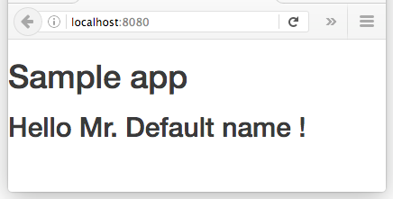

# 01 Hello Redux

In this sample we will create a full react + redux app just to display a HelloWorld like message.
Of course doing such a thing is an overkill. We use this simple sample to learn the
concepts.

We will take as our startup point "sample _00 Boilerplate".


Summary steps:

- Install react, react-dom, redux libraries.
- Install react, react-dom, redux typescript definitions.
- Update the index.html to create a placeholder for the react components.
- Create a HelloWorld component.
- Create an _main.tsx_ as entry point.
- Create the react-dom entry point _main.tsx_.
- Create a reducer (it will hold user name).
- Wire it up.
- Create a HelloworldContainer component and perform the connections.
- Include this HelloworldContainer component in the _main.tsx_

# Prerequisites

Install [Node.js and npm](https://nodejs.org/en/) (v6.6.0) if they are not already installed on your computer.

> Verify that you are running at least node v6.x.x and npm 3.x.x by running `node -v` and `npm -v` in a terminal/console window. Older versions may produce errors.

## Steps to build it

- Copy the content from _00 Boilerplate_ and execute _npm install_.

- Let's install react, react-dom and redux libraries:

```javascript
npm install react react-dom redux react-redux --save
```

- let's install typescript definitions for these libraries:

```
npm install @types/react @types/react-dom @types/react-redux --save-dev
```

- Rename _./src/main.ts_ to _./src/main.tsx_.

- Update webpack config in the _./src/webpack.config.js_ file, in order to take as entry point _main.tsx_

### ./webpack.config.js
```diff
entry: [
- './main.ts',
+ './main.tsx',
  '../node_modules/bootstrap/dist/css/bootstrap.css'
],

```

- Update the index.html to create a placeholder for the react components

### ./src/index.html
```diff
<!DOCTYPE html>
<html>
  <head>
    <meta charset="utf-8">
    <title></title>
  </head>
  <body>
    <h1>Sample app</h1>
+   <div id="root">
+   </div>    
  </body>
</html>
```

- Create the react-dom entry point _main.tsx_ (and remove the old `main.ts`).

### ./src/main.tsx
```javascript
import * as React from 'react';
import * as ReactDOM from 'react-dom';

ReactDOM.render(
  <h2>Temp content</h2>,
  document.getElementById('root'));

```

- Create a HelloWorld component, path : _./src/helloWorld.tsx_.

### ./src/helloWorld.tsx
```javascript
import * as React from 'react';

export const HelloWorldComponent = (props : {userName : string}) => {
  return (
    <h2>Hello Mr. {props.userName} !</h2>
  );
}
```

- Create a reducer (it will hold user name), path: `./src/reducers/userProfile.ts`.

### ./src/reducers/userProfile.ts
```javascript
class UserProfileState {
  firstname : string;

  constructor() {
    this.firstname = "Default name";
  }
}

export const userProfileReducer =  (state : UserProfileState = new UserProfileState(), action) => {
  return state;
};

```

- Let's create an index file under `./src/reducers/index.ts` this file will
combine all reducers references in the future.

### ./src/reducers/index.ts
```javascript
import { combineReducers } from 'redux';
import { userProfileReducer } from './userProfile';

export const reducers =  combineReducers({
  userProfileReducer
});

```

- Wire it up in the existing _main.tsx_.

### ./src/main.tsx
```diff
import * as React from 'react';
import * as ReactDOM from 'react-dom';
+ import { createStore } from 'redux';
+ import { Provider } from 'react-redux';
+ import {reducers} from './reducers';
+ import {HelloWorldComponent} from './helloWorld';

+ const store = createStore(reducers);

ReactDOM.render(
- <h2>Temp content</h2>,
+ <Provider store={store}>
+  <HelloWorldComponent/>
+ </Provider>,
  document.getElementById('root'));

```

- Create a HelloworldContainer component and perform the connections, full path
`./src/helloWorldContainer.ts`.

### ./src/helloWorldContainer.tsx
```javascript
import { connect } from 'react-redux';
import { HelloWorldComponent } from './helloWorld';

const mapStateToProps = (state) => {
  return {
    userName: state.userProfileReducer.firstname
  }
}

const mapDispatchToProps = (dispatch) => {
  return {
  }
}

export const HelloWorldContainer = connect(
  mapStateToProps,
  mapDispatchToProps
)(HelloWorldComponent);

```

- Include this HelloworldContainer component in the application, path: _.src/main.tsx_

### ./src/main.tsx
```diff
import * as React from 'react';
import * as ReactDOM from 'react-dom';
import { createStore } from 'redux';
import { Provider } from 'react-redux';
import {reducers} from './reducers';
- import {HelloWorldComponent} from './helloWorld';
+ import {HelloWorldContainer} from './helloWorldContainer';

let store = createStore(reducers);

ReactDOM.render(
   <Provider store={store}>
-     <HelloWorldComponent/>
+     <HelloWorldContainer/>
   </Provider>
  , document.getElementById('root'));

```

- Let's give a try to the sample.

```
npm start
```

()
