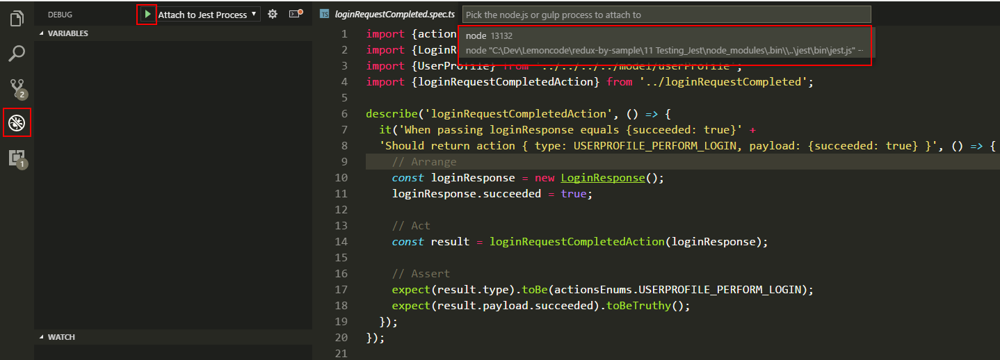
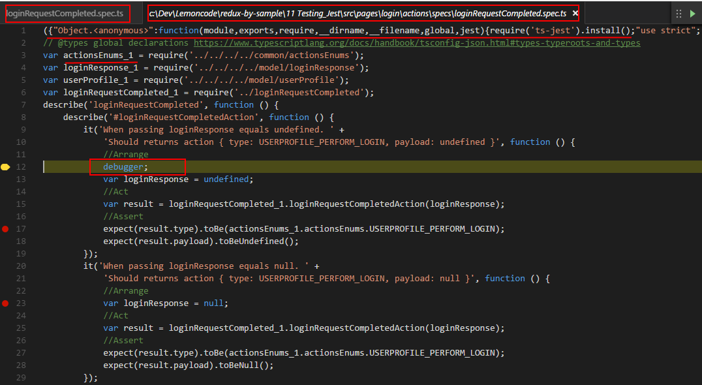
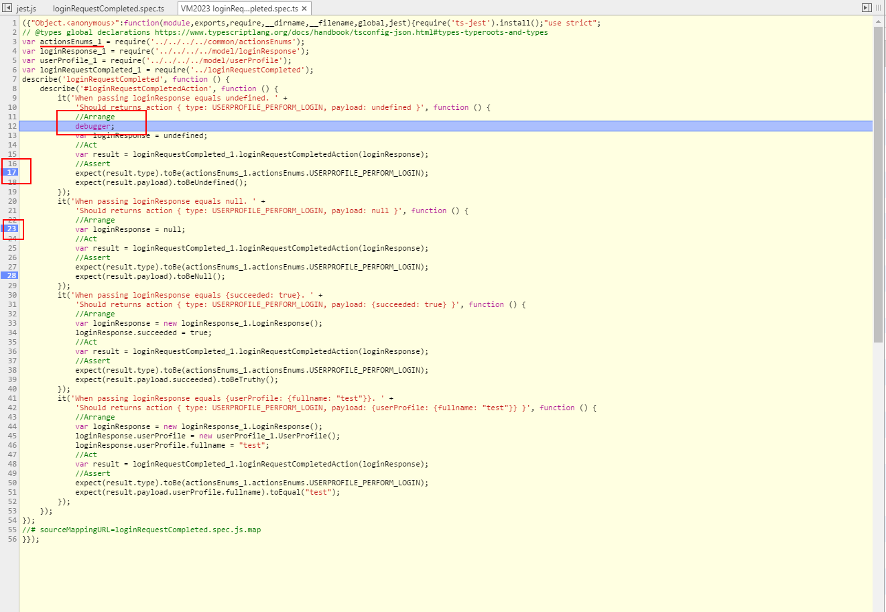

# 11 Testing_Jest

This sample series takes as starting point _10 HotLoader_

In this sample we are going to add unit testing with Jest:

- We will add configuration to work with Webpack TypeScript and Jest.
- We will add some unit tests:
    - actions
    - reducers
    - components
- We will add code coverage.

Summary steps:
- Add all the needed packages.
- Configure Jest.


# Prerequisites

Install [Node.js and npm](https://nodejs.org/en/) (v6.6.0) if they are not already installed on your computer.

> Verify that you are running at least node v6.x.x and npm 3.x.x by running `node -v` and `npm -v` in a terminal/console window. Older versions may produce errors.

## Steps to build it

- Copy the content from _10 HotLoader_ and execute _npm install_.

Let's start by installing the testing libraries:

- [jest](https://github.com/facebook/jest): JavaScript Testing library with runner, assertion, mocks, etc.
- [redux-mock-store](https://github.com/arnaudbenard/redux-mock-store): A mock store for testing your redux async action creators and middleware.
- [ts-jest](https://github.com/kulshekhar/ts-jest): A preprocessor with sourcemap support to help use Typescript with Jest.
- [@types/jest](https://github.com/DefinitelyTyped/DefinitelyTyped/blob/master/jest/jest.d.ts): Typings for jest.
- [@types/redux-mock-store](https://github.com/DefinitelyTyped/DefinitelyTyped/blob/master/redux-mock-store/redux-mock-store.d.ts): Typings for redux-mock-store.
- [deep-freeze](https://github.com/substack/deep-freeze): To ensure immutability of the reducers.
- [@types/deep-freeze](https://github.com/DefinitelyTyped/DefinitelyTyped/blob/master/deep-freeze/deep-freeze.d.ts): Typings for deep-freeze.
- [react-test-renderer](https://www.npmjs.com/package/react-test-renderer): provides an experimental React renderer that can be used to render React components to pure JavaScript objects, without depending on the DOM or a native mobile environment.
- [@types/webpack-env](https://github.com/DefinitelyTyped/DefinitelyTyped/blob/master/webpack/webpack-env.d.ts): Typings to use require from webpack.

## Configuration

- Jest typings configuration to work with [jest global declarations](https://github.com/DefinitelyTyped/DefinitelyTyped/pull/11830):

*tsconfig.json*
```javascript
{
  "compilerOptions": {
  ...
    "types": ["jest"]
  },
  ...
}
```

- Due to *react-test-renderer* doesn't have typings on *DefinitelyTyped*, we have to use webpack-env to require js lib. Webpack-env typings configuration to work with global declarations:

*tsconfig.json*
```javascript
{
  "compilerOptions": {
  ...
    "types": ["jest", "webpack-env"]
  },
  ...
}
```

- Jest test commands:
  - `npm test`: to single run
  - `npm run test:watch`: to run all specs after changes.

NOTE:
> --watchAll To rerun all tests.

> --watch To rerun tests related to changed files.

> --verbose Display individual test results with the test suite hierarchy.

*package.json*
```javascript
{
  ...
  "scripts": {
    ...
    "test": "jest --verbose",
    "test:watch": "jest --watchAll --verbose"
  }
  ...
}
```

- Jest configuration:

*package.json*
```javascript
{
  ...
  "jest": {
    "testPathDirs": [
      "<rootDir>/src/"
    ],
    "testRegex": "(/specs/.*|\\.spec)\\.(ts|tsx)$",
    "moduleFileExtensions": [
      "ts",
      "tsx",
      "js"
    ],
    ...
  }
}
```

- ts-jest configuration:

*package.json*
```javascript
{
  ...
  "jest": {
    ...
    "transform": {
      ".(ts|tsx)": "<rootDir>/node_modules/ts-jest/preprocessor.js"
    }
  }
}
```

## Adding action tests

Let's launch tests in watch mode:

```
npm run test:watch
```

- Adding unit tests support to the *loginRequestCompleted* action. We will implement a simple test, in the implemented sample code you can find a battery of unit tests already implemented.

*./src/pages/login/actions/specs/loginRequestCompleted.spec.ts*
```javascript
import {actionsEnums} from '../../../../common/actionsEnums';
import {LoginResponse} from '../../../../model/loginResponse';
import {UserProfile} from '../../../../model/userProfile'
import {loginRequestCompletedAction} from '../loginRequestCompleted';

describe('loginRequestCompleted', () => {
  describe('#loginRequestCompletedAction', () => {
    it('When passing loginResponse equals {succeeded: true}' +
    'Should return action { type: USERPROFILE_PERFORM_LOGIN, payload: {succeeded: true} }', () => {
      //Arrange
      let loginResponse = new LoginResponse();
      loginResponse.succeeded = true;

      //Act
      var result = loginRequestCompletedAction(loginResponse);

      //Assert
      expect(result.type).toBe(actionsEnums.USERPROFILE_PERFORM_LOGIN);
      expect(result.payload.succeeded).toBeTruthy();
    });
  });
});
```

- Now it's time to go for a case that has a greater level of completexity, we are going to test an async action (thunk) and we will have to mock dependencies (rest api), the action we are going to test is loginRequestStarted.

*./src/pages/login/actions/specs/loginRequestStarted.spec.ts*
```javascript
import configureStore from 'redux-mock-store';
import ReduxThunk from 'redux-thunk';
const middlewares = [ ReduxThunk ];
const mockStore = configureStore(middlewares);
import {hashHistory} from 'react-router';

import {loginRequestStartedAction} from '../loginRequestStarted';
import {loginRequestCompletedAction} from '../loginRequestCompleted';
import {loginApi} from '../../../../rest-api/loginApi';
import {actionsEnums} from '../../../../common/actionsEnums';
import {LoginEntity} from '../../../../model/login';
import {LoginResponse} from '../../../../model/loginResponse';

describe('loginRequestStarted', () => {
  describe('#loginRequestStartedAction', () => {
    it('When passing loginEntity.login equals "test login" and expected LoginResponse.succeeded equals true ' +
    'Should calls loginApi.login(loginEntity), hashHistory.push and dispatch loginRequestCompletedAction action', () => {
      //Arrange
      let loginEntity = new LoginEntity();
      loginEntity.login = "test login";

      let expectedData = new LoginResponse();
      expectedData.succeeded = true;

      loginApi.login = jest.fn(() => {
        return  {
          then: callback => {
            callback(expectedData);
          }
        };
      });

      hashHistory.push = jest.fn();

      //Act
      const store = mockStore([]);

      store.dispatch(loginRequestStartedAction(loginEntity))
        .then((data) => {
          //Assert
          expect(loginApi.login).toHaveBeenCalledWith(loginEntity);
          expect(data).toBe(expectedData);
          expect(store.getActions()[0].type).toBe(actionsEnums.USERPROFILE_PERFORM_LOGIN);
          expect(store.getActions()[0].payload).toBe(expectedData);
          expect(hashHistory.push).toHaveBeenCalledWith('/student-list');
        });
    });
  });
});
```

## Adding reducer tests

Now let's add a simple test

*./src/reducers/specs/session.spec.ts*

```javascript
import * as deepFreeze from 'deep-freeze';
import {actionsEnums} from '../../common/actionsEnums';
import {UserProfile} from '../../model/userProfile';
import {LoginEntity} from '../../model/login';
import {sessionReducer} from '../session';

describe('session', () => {
  describe('#handlePerformLogin', () => {
    it('When passing initialState with defaul values and an action type USERPROFILE_PERFORM_LOGIN with successful values. ' +
    'Should returns new immutable SessionState with payload values', () => {
      //Arrange
      let initialState = {
        isUserLoggedIn: false,
        userProfile: new UserProfile(),
        editingLogin: new LoginEntity()
      };

      let action = {
        type: actionsEnums.USERPROFILE_PERFORM_LOGIN,
        payload: {
          succeeded: true,
          userProfile: {
            fullname: 'Jonh Doe',
            role: 'admin'
          },
        }
      };

      //Act
      let finalState = sessionReducer(initialState, action);

      //Assert
      expect(finalState.isUserLoggedIn).toBeTruthy();
      expect(finalState.userProfile.fullname).toEqual("Jonh Doe");
      expect(finalState.userProfile.role).toEqual("admin");
      expect(finalState.editingLogin).toEqual(new LoginEntity());
    });
  });
});
```

- A final check for this test, reducers should be immutable, we can check this in the unit tests by using deep-freeze:

*./src/reducers/specs/session.spec.ts*

```javascript
import * as deepFreeze from 'deep-freeze';
import {actionsEnums} from '../../common/actionsEnums';
import {UserProfile} from '../../model/userProfile';
import {LoginEntity} from '../../model/login';
import {sessionReducer} from '../session';

describe('session', () => {
  describe('#handlePerformLogin', () => {
    it('When passing initialState with defaul values and an action type USERPROFILE_PERFORM_LOGIN with successful values. ' +
    'Should returns new immutable SessionState with payload values', () => {
      //Arrange
      let initialState = {
        isUserLoggedIn: false,
        userProfile: new UserProfile(),
        editingLogin: new LoginEntity()
      };

      deepFreeze(initialState);

      let action = {
        type: actionsEnums.USERPROFILE_PERFORM_LOGIN,
      ...
    });
  });
});
```

## Adding reducer tests

- Now let's add a simple test

*./src/pages/login/components/specs/header.spec.tsx*

```javascript
import * as React from 'react';
const renderer: any = require('react-test-renderer');
import {Header} from '../header';

describe('header', () => {
  describe('#render', () => {
    it('renders correctly', () => {
      //Arrange

      //Act
      const tree = renderer.create(
        <Header />
      ).toJSON();

      //Assert
      expect(tree).toMatchSnapshot();
    });
  });
});
```

When we run this test, it creates a snapshot test file:

Note:
> We should include this file in repository so everybody can view this file in PR.

*./src/pages/login/components/specs/__snapshots__/header.spec.tsx.snap*

```
exports[`header #render renders correctly 1`] = `
<div
  className="panel-heading">
  <h3
    className="panel-title">
    Please sign in (login: admin / pwd: test)
  </h3>
</div>
`;
```

- Let's continue by adding test to sutendtRow.tsx checking that the row is displaying the expected data:

*./src/pages/student-list/components/specs/studentRow.spec.tsx*

```javascript
import * as React from 'react';
const renderer: any = require('react-test-renderer');
import {StudentRowComponent} from '../studentRow';
import { StudentEntity } from '../../../../model/student';

describe('StudentRowComponent', () => {
  it('Should render a row with a given name and email', () => {
    //Arrange
    const student = new StudentEntity();
    student.id = 2;
    student.gotActiveTraining = true;
    student.fullname = "John Doe";
    student.email = "john@email.com";

    //Act
    const tree = renderer.create(
      <StudentRowComponent
        student={student}
        editStudent={() => {}}
       />
    ).toJSON();

    //Assert
    expect(tree).toMatchSnapshot();
  });
});
```

Snapshot:

*./src/pages/student-list/components/specs/__snapshots__/studentRow.spec.tsx.snap*

```
exports[`StudentRowComponent Should render a row with a given name and email 1`] = `
<tr>
  <td>
    <span
      aria-hidden="true"
      className="glyphicon glyphicon-ok" />
  </td>
  <td>
    <span>
      John Doe
    </span>
  </td>
  <td>
    <span>
      john@email.com
    </span>
  </td>
  <td>
    <div
      onClick={[Function]}>
      <span
        aria-hidden="true"
        className="glyphicon glyphicon-pencil" />
    </div>
    <span
      aria-hidden="true"
      className="glyphicon glyphicon-trash" />
  </td>
</tr>
`;
```

- And simulating a click event:
*./src/pages/student-list/components/specs/studentRow.spec.tsx*

```javascript
it('Should interact to the click on edit student and returns as param 2 student Id', () => {
  //Arrange
  const student = new StudentEntity();
  student.id = 2;
  student.gotActiveTraining = true;
  student.fullname = "John Doe";
  student.email = "john@email.com";

  const onEditStudentMock = jest.fn();

  //Act
  const tree = renderer.create(
    <StudentRowComponent
      student={student}
      editStudent={onEditStudentMock}
     />
  ).toJSON();

  const tdContainingDivClickable = tree.children[3];
  const divClickable = tdContainingDivClickable.children[0];

  divClickable.props.onClick();

  //Assert
  expect(tree).toMatchSnapshot();
  expect(onEditStudentMock).toHaveBeenCalled();
  expect(onEditStudentMock).toHaveBeenCalledWith(student.id);
});
```

Snapshot:

*./src/pages/student-list/components/specs/__snapshots__/studentRow.spec.tsx.snap*

```
exports[`StudentRowComponent Should interact to the click on edit student and returns as param 2 student Id 1`] = `
<tr>
  <td>
    <span
      aria-hidden="true"
      className="glyphicon glyphicon-ok" />
  </td>
  <td>
    <span>
      John Doe
    </span>
  </td>
  <td>
    <span>
      john@email.com
    </span>
  </td>
  <td>
    <div
      onClick={[Function]}>
      <span
        aria-hidden="true"
        className="glyphicon glyphicon-pencil" />
    </div>
    <span
      aria-hidden="true"
      className="glyphicon glyphicon-trash" />
  </td>
</tr>
`;
```

## Code Coverage configuration

- `--coverage`: to enable coverage.
- `--no-cache`: disable cache to avoid issues with sourcemaps.

*package.json*
```javascript
{
  ...
  "scripts": {
    ...
    "test": "jest --verbose --coverage --no-cache",
    "test:watch": "jest --watchAll --verbose --no-cache"
  }
  ...
}
```

- Jest configuration:

*package.json*
```javascript
{
  ...
  "jest": {
    ...
    "testResultsProcessor": "<rootDir>/node_modules/ts-jest/coverageprocessor.js",
    "coverageDirectory": "<rootDir>/coverage"
  }
}
```

- Execute `npm test` to single run test with coverage.

## Debugging Jest

Jest is running over node, so we can't use, for example, PhantomJS like we are using in karma.
Then, we have two alternatives to debugging jest:

### Using VS Code

As we know, VS Code provides by default a [node debugger](https://code.visualstudio.com/Docs/editor/debugging):

- Adding debug launch.json in VS Code:

 

 - Configuring launch.json to work with external node process:

 *.vscode/launch.json*:

 ```json
 {
   "version": "0.2.0",
   "configurations": [
     {
       "name": "Attach to Jest Process",
       "type": "node",
       "request": "attach",
       "processId": "${command.PickProcess}",
       "port": 5858,
       "sourceMaps": true,
       "outDir": null
     }
   ]
 }
 ```

- Run `npm run test:watch`.

- Run VS Code debugger, selecting watch process:



- Now, it's important to put the special key `debugger` in our spec.ts (only for debugging, then remove it) because *jest*/*ts-jest* are
generating ts files from sourcemaps instead of using original ts files to debug.
Then we can add breakpoints from VS Code:



### Using Node Inspector

- Let's install [node-inspector](https://github.com/node-inspector/node-inspector):

```
npm install node-inspector --save-dev
```

- Configure npm command:

- `-i` or `--runInBand`: to run all tests serially in the current process.

*package.json*
```javascript
{
  ...
  "scripts": {
    ...
    "test:debug": "node-debug ./node_modules/jest/bin/jest.js --watchAll --verbose --no-cache -i"
  }
}
```

- Run `npm run test:debug` (it's take a about 5 seconds to start find src files).

- Now, it's important to put the special key `debugger` in our spec.ts (only for debugging, then remove it) because *jest*/*ts-jest* are
generating ts files from sourcemaps instead of using original ts files to debug.
Then we can add breakpoints from browser:


